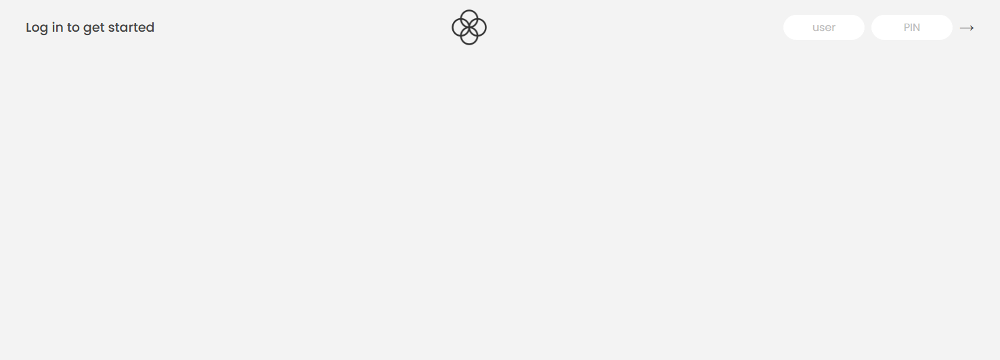
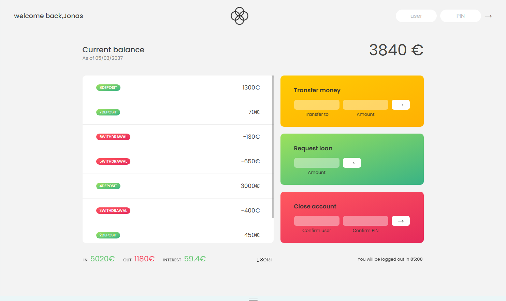

# 🏦 Bankist App

A simple banking application built with **HTML**, **CSS**, and **Vanilla JavaScript**.

This project was developed as part of the JavaScript course by Jonas Schmedtmann and focuses on practicing JavaScript array methods, DOM manipulation, and event handling.

---

## ✨ Features

- 🔐 User Login Authentication
- 💰 Display Account Balance
- 📋 View Transaction History
- 📈 Calculate Income, Expenses, and Interest
- 💸 Transfer Money Between Accounts
- 🏦 Request a Loan
- ❌ Close an Existing Account
- 🔃 Sort Transactions
- 👋 Personalized Welcome Message
- 📊 Automatic UI Updates

---

## 🛠️ Technologies Used

- HTML5
- CSS3
- JavaScript (ES6)

### JavaScript Concepts Practiced

- DOM Manipulation
- Event Listeners
- Arrays
- Objects
- forEach()
- map()
- filter()
- reduce()
- find()
- findIndex()
- some()
- every()
- flatMap()
- sort()
- Template Literals
- Arrow Functions

---

## 📂 Project Structure

```
├── index.html
├── style.css
├── script.js
├── logo.png
├── icon.png
└── README.md
```

---

## 🚀 How to Run

1. Clone the repository

```bash
git clone https://github.com/YourUsername/bankist-app.git
```

2. Open the project folder.

3. Run `index.html` in your browser or use **Live Server** in VS Code.

---

## 🔑 Demo Accounts

| Username | PIN |
|----------|-----|
| js | 1111 |
| jd | 2222 |
| stw | 3333 |
| ss | 4444 |

---

## 🎮 Available Operations

- Login
- View Movements
- Check Balance
- Money Transfer
- Loan Request
- Close Account
- Sort Transactions

---

## 📸 Screenshots

### Login



### Dashboard



### Money Transfer


### Loan


---

## 📚 What I Learned

During this project I practiced:

- JavaScript array methods
- DOM manipulation
- Event handling
- Functional programming concepts
- Working with objects and arrays
- Building interactive user interfaces

---

## 👨‍💻 Author

**Bita Behzadi**
